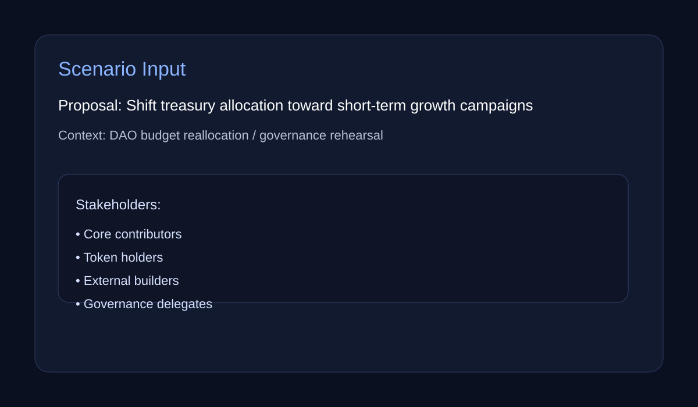
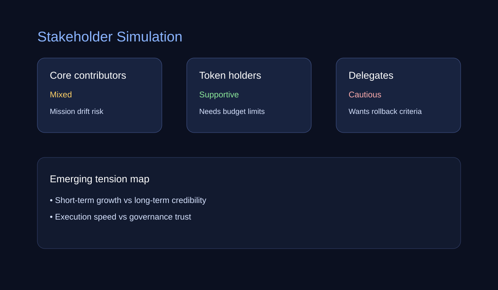
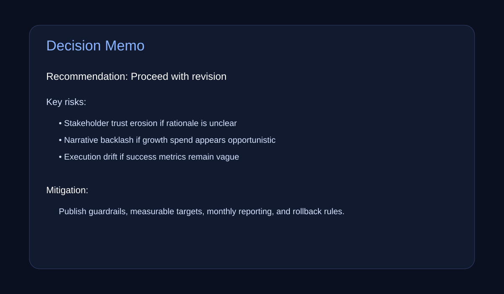

# governance-sandbox

Agent-based governance scenario rehearsal engine for testing proposals, stakeholder reactions, and decision risks before real-world execution.

If you need a stdin-first replay note for piping one JSON or YAML scenario directly into report generation, open `docs/SCENARIO_STDIN_JSON_YAML_NOTE.md`.

> Rehearse governance decisions in a simulated stakeholder environment before you ship them to reality.

---

## The problem

Governance decisions often fail not because the proposal is invalid, but because stakeholders react in unexpected ways, communication breaks down, or second-order effects are ignored.

`governance-sandbox` is designed to help teams rehearse proposals before launch by simulating stakeholder perspectives, surfacing likely tensions, and generating a structured decision memo.

---

## Demo Preview

- Demo concept: scenario input → stakeholder simulation → decision memo
- Planned live demo: `docs/assets/examples/demo-link.md`
- Current MVP output: local CLI-generated governance rehearsal report

<table>
<tr>
<td></td>
<td></td>
<td></td>
</tr>
</table>

---

## 3-step how it works

### 1) Input a governance proposal
Provide a short proposal description, target decision context, and optional constraints.

### 2) Simulate stakeholder responses
The engine generates multiple stakeholder perspectives and predicts likely support, concern, or resistance patterns.

### 3) Produce a decision memo
The system outputs a structured memo with risks, tensions, recommended mitigations, and a go/no-go style summary.

---

## Sample scenario

Scenario files can also include an optional scenario name and decision context that appear in markdown/html reports.


**Scenario:**
A DAO plans to change treasury allocation from long-term ecosystem grants to short-term growth campaigns. Stakeholders include core contributors, token holders, external builders, and governance delegates.

**Expected questions:**
- Will short-term growth weaken long-term trust?
- Which stakeholders resist first?
- What messaging or safeguards reduce backlash?

---

## Quickstart

```bash
PYTHONPATH=src python3 -m governance_sandbox.cli run \
  --proposal "Shift 25% of treasury budget from grants to growth campaigns" \
  --stakeholders "core contributors,token holders,external builders,governance delegates"
```

Or generate the default report bundle in one step:

```bash
PYTHONPATH=src python3 -m governance_sandbox.cli run \
  --scenario-file examples/scenario.yaml \
  --report-dir artifacts/demo
```

Use the richer scenario/report fixture when you want one YAML file to drive proposal input, stakeholder presets, report naming, and a reusable JSON/Markdown/HTML artifact bundle:

```bash
PYTHONPATH=src python3 -m governance_sandbox.cli run \
  --scenario-file examples/scenario-report-bundle.yaml \
  --report-dir artifacts/delegate-ready
```

For the shortest replayable scenario-file -> report-bundle workflow, open `docs/SCENARIO_REPORT_QUICKSTART.md`.
If you want a one-screen start note for the same scenario-file + report-dir bundle, open `docs/SCENARIO_REPORT_START.md`.
If you need a compact path check for one imported scenario file plus one generated report bundle, open `docs/SCENARIO_REPORT_PATHS_NOTE.md`.
If you want the same bundle flow with a ready-made JSON fixture, start with `examples/scenario-report-bundle.json`.
If you want the same flow from stdin for shell pipelines or browser-demo handoffs, pass `--scenario-file -` and pipe JSON/YAML into the CLI.
If you want one fixture to keep proposal/stakeholders under `inputs` and report metadata under `inputs.report`, open `docs/GOVERNANCE_SANDBOX_SCENARIO_INPUTS_REPORT_NOTE.md`.
If you want a demo-oriented fixture for the first web form plus report-card flow, start with `examples/scenario-web-demo.yaml`.
If you need a compact UI boundary note before widening that first form-to-card slice, open `docs/WEB_DEMO_FORM_TO_CARD_SCOPE.md`.
If you need a compact acceptance note for when that first result card plus report path is actually reviewable, open `docs/WEB_DEMO_RESULT_CARD_ACCEPTANCE.md`.
If you need a one-line maintainer update once that first result-card proof is believable, open `docs/WEB_DEMO_RESULT_CARD_STATUS_LINE.md`.
If you want the shortest UI/UX handoff note before widening the first web demo, open `docs/GOVERNANCE_SANDBOX_UI_UX_PRO_MAX_BRIDGE.md`.
If you want a DAO-flavored treasury automation rehearsal with presets plus a named report bundle, start with `examples/dao-treasury-automation.yaml`.
If you want a broader preset mix that highlights community-trust tradeoffs plus a named memo bundle, start with `examples/scenario-community-feedback.yaml`.
If you want one reusable fixture that exercises all built-in stakeholder presets in a single report bundle, start with `examples/scenario-preset-roundtable.yaml`.
If you want the same scenario-file flow as a compact DAO-oriented JSON fixture, start with `examples/scenario-dao-report-bundle.json`.
CLI-provided relative `--report-json`, `--report-markdown`, and `--report-html` paths now resolve from the scenario-file directory, so replayable fixtures can keep outputs beside the imported scenario without shell-specific path glue.
If you need a machine-readable preset inventory for scenario generators or web-demo forms, run `PYTHONPATH=src python3 -m governance_sandbox.cli run --list-presets-json`.
That preset-aware report flow now keeps a short preset summary beside each known preset in markdown/html stakeholder sections, so memo readers can see the trait meaning without reopening preset docs.
If you want a tiny scenario-file fixture that demonstrates top-level `report_targets` + `report_tags` aliases, start with `examples/scenario-report-targets-alias.yaml`.
That JSON inventory now includes a label and a short summary for each preset so scenario builders and UI forms can explain the trait choice without hard-coding copy.
Scenario files can also carry `report.audience` / `report.audiences` (or top-level `report_audience`, `report_audiences`, `report_readers`, `report_targets`, `audience`, or `audiences`) so markdown/html outputs state who the memo is for without duplicating handoff copy outside the fixture.
Scenario files can now also carry `report.owner` / `report.owners` (or top-level `report_owner`, `report_owners`, `owner`, or `owners`) so markdown/html outputs keep the maintainer handoff visible beside the audience metadata.
If you need the fastest scenario-file -> rendered-audience proof before wider report-bundle or web-demo work, open `docs/SCENARIO_REPORT_AUDIENCE_START.md`.
If you need a compact handoff note for keeping scenario-file audience and owner metadata visible together in one generated report bundle, open `docs/SCENARIO_REPORT_OWNER_AUDIENCE_HANDOFF.md`.
If you need the shortest metadata-first replay before widening scenario bundles or the first web demo, open `docs/SCENARIO_REPORT_METADATA_START.md`.
If you need one scenario file to produce a title-ready report bundle for humans without reopening the JSON first, start with `examples/scenario-community-feedback.yaml`.
If you need a compact start note for keeping one scenario replay tied to one reusable JSON/Markdown/HTML artifact bundle, open `docs/SCENARIO_REPORT_ARTIFACT_BUNDLE_START.md`.
If you need the shortest scenario-file -> generated report bundle replay before widening scope, open `docs/SCENARIO_FILE_REPORT_START.md`.
If you need a one-line check that the imported scenario already produced the full report stack, open `docs/SCENARIO_REPORT_STACK_CHECK.md`.
If you need the narrowest scenario-file -> result card -> report-download start note before widening the first web demo, open `docs/SCENARIO_REPORT_RESULT_CARD_START.md`.
If you need a tiny download signoff note once that first web demo is already believable, open `docs/GOVERNANCE_SANDBOX_WEB_DEMO_DOWNLOAD_SIGNOFF.md`.

---

## Why this project exists

Most governance tooling focuses on voting, execution, or on-chain recordkeeping.
Much less attention is given to **pre-decision rehearsal**:

- What happens if this proposal is misunderstood?
- Which stakeholders align or oppose it first?
- Which mitigation language should appear before launch?
- What second-order narrative risks are visible early?

This project exists to fill that gap.

---

## Product direction

This repository is intended to become a long-lived public simulation layer for governance teams, DAOs, policy groups, and agent-native decision systems.

### Direction 1 — Decision support over prediction theater
We do not aim to "predict everything." We aim to improve the quality of governance decisions by making reactions and tradeoffs easier to inspect.

### Direction 2 — Scenario clarity over model complexity
A smaller, auditable system with explicit assumptions is more useful than a flashy black box.

### Direction 3 — Governance-native workflows
Outputs should resemble real decision artifacts:

- stakeholder map
- alignment/conflict matrix
- risk summary
- mitigation recommendations
- final decision memo

### Direction 4 — Demo-ready public repos
Every release should improve the public-repo surface:

- cleaner README
- stronger visual walkthroughs
- scenario examples
- reproducible commands
- evidence of practical use

### Direction 5 — Extensible domain packs
Long term, this engine can support multiple domain packs:

- DAO governance
- public sentiment rehearsal
- internal org decision rehearsal
- policy and communications scenarios

---

## MVP scope

Current MVP includes:

- proposal input
- stakeholder list input
- simple heuristic response simulation
- structured decision memo output

Near-term additions:

- richer stakeholder traits and scenario presets
- conflict graph export
- lightweight web demo for replayable proposal input and result cards
- demo GIF once the first web flow is stable

Current CLI additions now include:

- optional scenario metadata (`name`, `context` / `decision_context`) loaded from scenario files and surfaced in reports
- `--scenario-file` for JSON/YAML proposal + stakeholder input
- nested scenario blocks (`scenario.name`, `scenario.context`, `inputs.proposal`, `inputs.stakeholders`) for reusable demo fixtures and UI handoff payloads
- scenario-file aliases for lightweight imports (`title` → scenario name, `decision`/`summary` → report context, `proposal_text`/`prompt` → proposal, `participants`/`actors` → stakeholders, stakeholder `preset_name`/`preset_key`/`group`/`trait`/`segment`/`cohort`/`role` → preset, `preset_groups`/`stakeholder_preset_map` → stakeholder preset map)
- `--report-markdown` for a local decision memo report file
- `--report-html` for a lightweight visual report artifact
- `--report-json` for writing the structured output artifact to disk
- `--report-dir` for emitting a default report artifact bundle in one command
- scenario-file `report.json_path` / `report.markdown_path` / `report.html_path` aliases for fixture-driven output paths without repeating CLI flags
- top-level `report_json_path` / `report_markdown_path` / `report_html_path` aliases for scenario files that want output paths without nesting a `report` block
- scenario `tags` / `labels` for reusable demo fixtures and richer markdown/html report context
- optional scenario `report_title` / `report_heading` metadata for cleaner markdown/html memo headings, page titles, and demo handoff bundles
- nested `report.title` / `report.heading`, `report.tags`, and `report.description` blocks for report-first scenario fixtures and UI handoff payloads
- `report.name` as a scenario-file alias for the default report bundle basename when `--report-dir` is used
- `report.file_stem` as a scenario-file alias when the bundle should keep one reusable basename across JSON/Markdown/HTML artifacts
- `report.output_basename`, `report.output_name`, and top-level `report_basename` / `report_name` aliases for reviewer-ready report bundle basenames
- `report.description` feeds the generated markdown/html report summary so one scenario file can carry reviewer-facing memo context into CLI and web-demo handoffs
- `report.memo_summary` / `report.executive_summary` / `report.overview` / `report.memo` as summary aliases for scenario files that already carry memo-oriented report metadata
- `report.report_summary` as a nested scenario-file alias when UI/demo payloads already name the memo summary explicitly
- scenario `description` as a lightweight context alias for report-oriented fixtures
- outcome snapshot summaries in JSON + markdown/html reports so stakeholder stance balance is visible at a glance
- `run --list-presets` for built-in stakeholder trait groups (`dao`, `delegates`, `contributors`, `investors`, `community`)

---

## Repository structure

```text
governance-sandbox/
├─ README.md
├─ pyproject.toml
├─ src/governance_sandbox/
│  ├─ __init__.py
│  ├─ engine.py
│  └─ cli.py
├─ docs/assets/
│  ├─ screenshot-1.svg
│  ├─ screenshot-2.svg
│  └─ screenshot-3.svg
└─ .github/workflows/ci.yml
```

---

## Roadmap

### Phase 1
- MVP simulation engine
- CLI workflow
- launch-page style README

### Phase 2
- scenario file support
- markdown/html report generation
- richer stakeholder trait presets

### Phase 3
- domain packs
- visual stakeholder graph
- benchmark scenarios and replay comparison

### Phase 4
- browser UI
- saved simulation runs
- team workflow integration

---

## License

MIT


## Scenario-driven report bundles

Scenario files can now steer report bundle naming through `report.basename`, which is useful when you want stable markdown/html/json artifact names per rehearsal.
Configured `report.basename` values are sanitized into a safe slug so punctuation or path-like separators do not leak into the generated bundle paths.

```yaml
scenario:
  name: Treasury signal rehearsal
report:
  title: Delegate-ready rehearsal memo
  basename: delegate-ready-rehearsal
inputs:
  proposal: Add milestone checkpoints before treasury growth experiments.
  stakeholders:
    - name: Delegate circle
      preset: delegates
```

Then run `gov-sandbox run --scenario-file scenario.yaml --report-dir artifacts/` to produce `delegate-ready-rehearsal.json`, `.md`, and `.html`.
If `report.basename` is omitted, `report.title` becomes the default bundle basename before the CLI falls back to generic `report.*` filenames.

Scenario maps can now use nested stakeholder objects with alias fields like `label`/`title` plus `trait_preset`, which keeps JSON/YAML scenario files readable while still producing the same preset-backed report outputs.

Scenario files may also use `report.bundle_dir`, nested `report.report_dir`, or top-level `report_output_dir` aliases when one scenario fixture should own the entire JSON/markdown/HTML bundle directory without repeating CLI flags.
